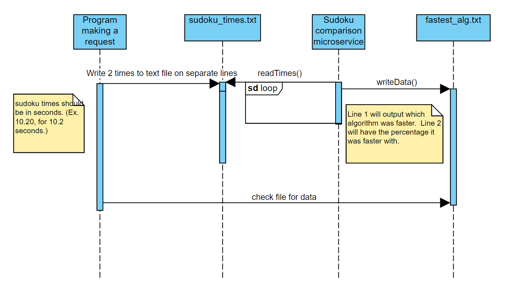

README

Overview:
This microservice was developed to compare to sudoku algorithem times.  It will return which algorithem was faster and the % it was faster.

Request Data:
1. Run the ms_sudkou_comparison.py in your terminal.
2. Write two algorithem times to 
     Line 1 will = Algorithm 1.
     Line 2 will = Algorithm 2.

4. Wait 2 seconds.  The microservice will calculate the values and write the values to fastest_alg.txt

  Example can be found in sample_write_times.py
  code is listed below:
  
```python
def example_write():
     with open('./sudoku_times.txt', 'r+') as file1:
          file1.seek(0)
          file1.writelines(str(time1) + '\n')
          file1.writelines(str(time2))
          file1.truncate()
     file1.close()
'''

Receive Data:
1. Once the lap times are written on sudoku_times.txt, read the data from the fastest_alg.txt page.

  An example of how to read the textfile is shown in sample_read_alg.py and below:

```python
def example_read():
     with open('./fastest_alg.txt', 'r+') as file1:
          line1 = file1.readline()
          line2 = file1.readline()
          
          print("The fastest alg was:" + line1)
          print("It was faster by: " + line2)
     file1.close()
'''

Troubleshooting:
If data is not getting received please lookout for these things:
1. The main program is running.  The microservice ms_sudkou_comparison.py is running.
2. The .txt filenames are correct.
3. The formats are given in seconds.

UML Diagram:

